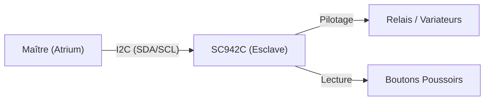

# 🏛️ Architecture

## Synoptique

Le module SC942C est une carte d'entrées/sorties pilotée par un bus **I2C**. Il agit comme un **esclave** sur le bus.

## Protocole de Communication (I2C)

*   **Adresse I2C par défaut** : `0x11` (7-bit)
*   **Vitesse** : Standard (100kHz) ou Fast (400kHz)
*   **Rôle** : Esclave

### Structure des Échanges

Le protocole fonctionne sur un mécanisme de **Commandes (Écriture)** et de **Status (Lecture)**.

1.  **Le Maître écrit** une trame commençant par un `Code Commande` suivi des paramètres.
2.  **Le Maître lit** (optionnel) pour vérifier l'état du dernier échange (ACK/NACK logique, erreurs).

## Tables de Référence (Maître -> Esclave)

Voici la liste des commandes disponibles pour piloter le module.

### 1. Forçage des Sorties (`0x01`)

Commande utilisée pour piloter directement les relais, variateurs et volets.

| Octet | Fonction | Description |
| :--- | :--- | :--- |
| 0 | **Code** | `0x01` |
| 1 | Relais OFF (LSB) | Masque d'extinction des relais 0-7 |
| 2 | Relais ON (LSB) | Masque d'allumage des relais 0-7 |
| 3 | Relais OFF (MSB) | Masque d'extinction des relais 8-15 |
| 4 | Relais ON (MSB) | Masque d'allumage des relais 8-15 |
| 5 | Variateurs OFF | Masque d'extinction des variateurs |
| 6 | Variateurs ON | Masque d'allumage des variateurs |
| 7 | Volets (Sens 1) | Commande Montée/Ouvrir |
| 8 | Volets (Sens 2) | Commande Descente/Fermer |

### 2. Configuration des Sorties (`0x02`)

Définit le mode de fonctionnement des variateurs (TOR ou Gradation).

| Octet | Fonction | Description |
| :--- | :--- | :--- |
| 0 | **Code** | `0x02` |
| 1 | Config Var 0 | `0`=TOR, `1`=Variateur, etc. |
| 2 | Config Var 1 | ... |
| n | Config Var n | ... |

### 3. Temps d'Extinction (`0x03`)

Configure la minuterie pour l'extinction automatique des relais.

| Octet | Fonction | Description |
| :--- | :--- | :--- |
| 0 | **Code** | `0x03` |
| 1 | Temps Relais 0 | En minutes (0 = pas de minuterie) |
| ... | ... | ... |

### 4. Temps d'Action Volets (`0x04`)

Configure la durée d'activation des relais pour les volets.

| Octet | Fonction | Description |
| :--- | :--- | :--- |
| 0 | **Code** | `0x04` |
| 1 | Temps Volet 0 | En secondes |
| ... | ... | ... |

### 5. Actions Globales (`0x05`)

Commandes spéciales (Sauvegarde, Reset, etc.).

| Octet | Fonction | Description |
| :--- | :--- | :--- |
| 0 | **Code** | `0x05` |
| 1 | Action | Bit 0: Sauvegarde EEPROM |

## Retour d'État (Esclave -> Maître)

Lors d'une lecture, l'esclave renvoie une structure de status (`TxBuf`).

| Bit | Nom | Description |
| :--- | :--- | :--- |
| **Byte 0** | **LastCode** | Code de la dernière trame reçue |
| **Byte 1** | **Flags** | État du module |
| ... Bit 0 | `chkfail` | Erreur de Checksum |
| ... Bit 1 | `rxerror` | Erreur de réception générique |
| ... Bit 2 | `ovflw` | Overflow Buffer |
| ... Bit 3 | `sspov` | Overflow Hardware (SSP) |
| ... Bit 4 | `noactivity` | Pas d'activité I2C détectée (Watchdog Com) |
