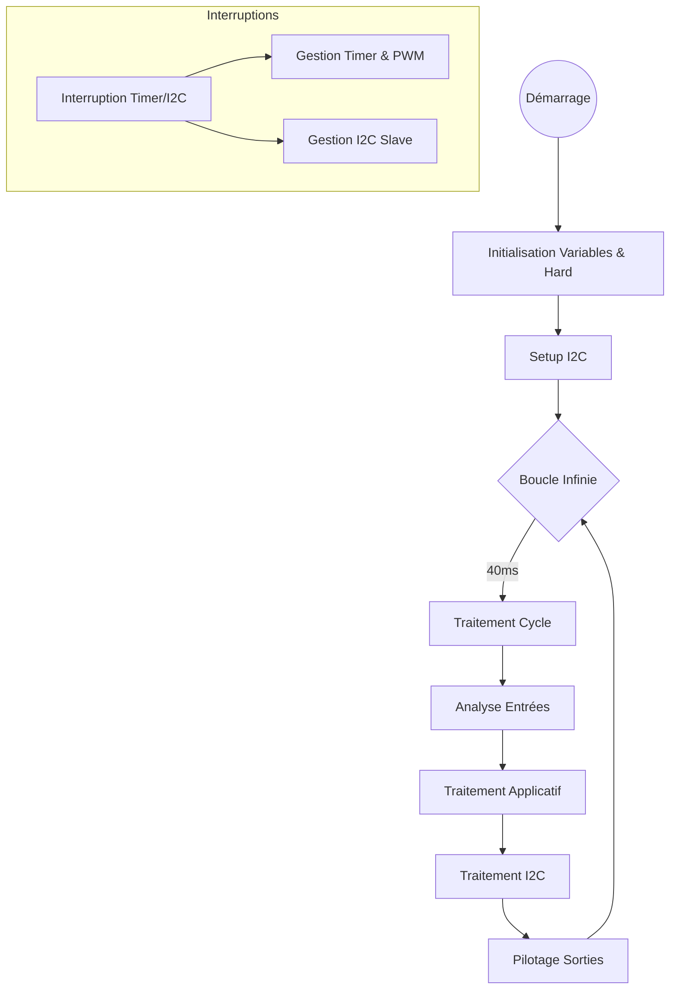
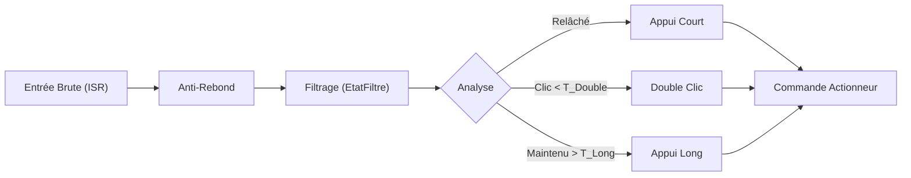

# ⚙️ Firmware

Cette page documente le firmware du module décodé depuis les sources fournies (`Prog/code_ba`).

## Environnement de Développement

*   **MCU Cible** : Famille Microchip PIC18 (Probablement PIC18Fxx vu les registres `TRISF`, `TRISE` etc.)
*   **Langage** : C (MPLAB C18 / XC8)
*   **Architecture** : Boucle principale sans OS + Interruptions

## Structure du Projet

Les fichiers sources sont organisés comme suit :

| Fichier | Description |
| :--- | :--- |
| `main.c` | Point d'entrée, boucle infinie, gestion du Watchdog. |
| `hard.h` / `hard.c` | Abstraction matérielle (HAL). Définition des broches (`#define`). |
| `gestionentrees.c` | Logique de filtrage, anti-rebond et détection (Simple/Double Clic, Appui Long). |
| `slavenode.c` | Gestion du protocole de communication I2C (Esclave) et commandes. |

## Mapping Mémoire (EEPROM)

L'EEPROM est utilisée pour stocker la configuration et l'état de sauvegarde.

| Adresse | Variable Stockée | Description |
| :--- | :--- | :--- |
| `0x0010` | `us_SortiesRelais` | État sauvegardé des relais simples (LSB/MSB). |
| `0x0014` | Config Variateurs | Mode des variateurs (3 octets par variateur). |
| `0x002A` | `uc_TempsCdeVolet` | Temps d'activation pour les volets. |
| `0x0032` | `uc_TempsCdeLampe` | Temporisation pour l'extinction automatique. |
| `0x0042` | Compteur | Compteur d'écriture EEPROM (Diagnostic). |

## Mapping Logique vs Physique

Basé sur `hard.h` (Configuration `TYPE_PIECES_DE_VIE_PROTO`), voici la correspondance entre les entrées logiques et les ports du microcontrôleur.

| Index Logique | Variable | Port MCU | Pin Physique (Est.) |
| :--- | :--- | :--- | :--- |
| 0 | `ENTREE0` | `PORTB<0>` | RB0 |
| 1 | `ENTREE1` | `PORTF<3>` | RF3 |
| 2 | `ENTREE2` | `PORTF<2>` | RF2 |
| 3 | `ENTREE3` | `PORTF<1>` | RF1 |
| 4 | `ENTREE4` | `PORTF<0>` | RF0 |
| 5 | `ENTREE5` | `PORTG<5>` | RG5 |
| 6 | `ENTREE6` | `PORTG<4>` | RG4 |
| 7 | `ENTREE7` | `PORTG<3>` | RG3 |
| 8 | `ENTREE8` | `PORTG<2>` | RG2 |
| 9 | `ENTREE9` | `PORTG<1>` | RG1 |
| 10 | `ENTREE10` | `PORTG<0>` | RG0 |
| 11 | `ENTREE11` | `PORTD<7>` | RD7 |

*(Extrait partiel, voir `hard.h` pour la liste complète)*

## Logique Fonctionnelle

### Boucle Principale

### Traitement des Entrées

Le fichier `gestionentrees.c` implémente une machine à états sophistiquée pour gérer les boutons poussoirs.

